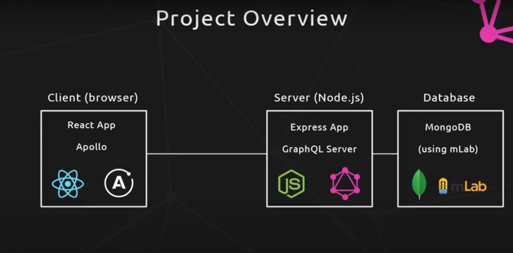

# Introduction
This repo contains the final code for the GraphQL course here https://www.youtube.com/watch?v=ed8SzALpx1Q

# Architect



# Note
- GraphQL is a query language that allows the front-end to decide what type of value they need to get and reduce its dependence with the server.
- GraphQL also saves the number of request you may need to send to the server
    **For example**
    Let's say from a list of book, you want to get one book, then the author of the book and finally all books that were written by that author.
    - The RESTful approach
        - *Get the book api* `/books/:id` => title, genre, reviews, authorId

        - *Get the author of that book* `/author/:id` => name, age, biography, bookIds

        - *Use another endpoint for the book list of that author* `/author/books` => books

    Or we can hit the first end with different ids but it might be a lot of api calls to display all books of that one particular author.

    - The graphql approach
    You only have one endpoint `/graphql` and you only need to call this query
    ```graphql
    {
        book(id: 123) {
            title
            genre
            reviews
            author {
                name
                bio
                books {
                    name
                }
            }
        }
    }
    ```

- Apollo gives you a lot of convenient utilities at the client to work with graphql